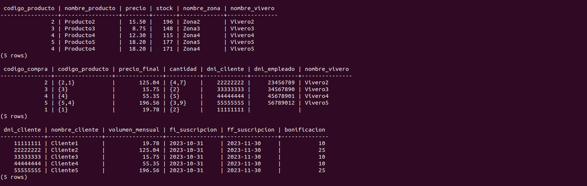

# Viveros-ADBD
## Práctica 3
Integrantes del grupo:
- ALICIA GUADALUPE CRUZ PÉREZ
- IVÁN TEXENERY DÍAZ GARCÍA

Para la práctica se ha seguido el siguiente modelo Entidad-Relación:

Y el siguiente modelo Relacional:

Se han empleado las siguientes operaciones:

1. Salida de un SELECT de cada tabla de la base de datos.

2. Operación DELETE: Atributo tabla **Vivero**.

3. Operación DELETE: Atributo tabla **Empleado**.

4. Operación DELETE: Atributo tabla **Zona**.

5. Operación DELETE: Atributo tabla **ClientePlus**.

